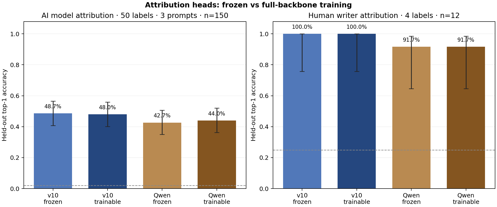

# Attribution head comparison

All four conditions use identical train, validation, and test documents. Validation selects the epoch; test is evaluated once per condition.

| Initialization | Backbone | Arena (50 AI models, n=150) | Top-5 | Four writers (n=12) |
|---|---|---:|---:|---:|
| v10 detector | Frozen | 48.7% (73/150) | 88.7% | 100.0% (12/12) |
| v10 detector | Fully trainable | 48.0% (72/150) | 88.7% | 100.0% (12/12) |
| Original Qwen3-1.7B | Frozen | 42.7% (64/150) | 78.7% | 91.7% (11/12) |
| Original Qwen3-1.7B | Fully trainable | 44.0% (66/150) | 80.0% | 91.7% (11/12) |

A random uniform guess is 2% for Arena and 25% for the writers. The bars show row-level 95% Wilson intervals. Arena responses share just three prompts, so its intervals understate uncertainty across new prompts. Per-label counts are in [Arena CSV](attribution_arena_by_model_v1.csv) and [writers CSV](attribution_authors_by_writer_v1.csv).

## Data and protocol

- [Arena Prose](https://huggingface.co/datasets/woog/arena-prose-100-49-models): 4,998 nonempty responses from 50 labels; 4,698 train, 150 validation, 150 test. Three responses per label are in each held-out split, with prompts disjoint across splits. Two source responses were empty and excluded.
- Named writers: 299 whole works across Gwern, Paul Graham, Scott Alexander, and Eliezer Yudkowsky; 275 train, 12 validation, 12 test. The newest three works per author are test, the preceding three validation.
- Each document is represented by up to eight 512-source-token Repeat2 windows, stride 256, with second-copy hidden states averaged by window and document. Full-backbone training samples one window per document per epoch; evaluation averages all windows.
- Frozen heads are linear softmax classifiers. Trainable conditions initialize from their corresponding frozen head and update all 1.72B backbone weights with Adafactor; the v10 adapter is merged before training. Each task has an independent backbone checkpoint.

## Metrics

| Condition | Task | Validation accuracy | Test accuracy | Test macro-F1 | Best epoch | W&B |
|---|---|---:|---:|---:|---:|---|
| v10 frozen | arena | 53.3% | 48.7% | 0.460 | 32 | [run](https://wandb.ai/eac-adsf/pangram-at-home/runs/feaijsj7) |
| v10 frozen | authors | 100.0% | 100.0% | 1.000 | 150 | [run](https://wandb.ai/eac-adsf/pangram-at-home/runs/le5d4hdi) |
| v10 trainable | arena | 52.0% | 48.0% | 0.452 | 1 | [run](https://wandb.ai/eac-adsf/pangram-at-home/runs/3tpsqp23) |
| v10 trainable | authors | 100.0% | 100.0% | 1.000 | 3 | [run](https://wandb.ai/eac-adsf/pangram-at-home/runs/i9r3zgbz) |
| Qwen frozen | arena | 47.3% | 42.7% | 0.401 | 18 | [run](https://wandb.ai/eac-adsf/pangram-at-home/runs/8lnqstly) |
| Qwen frozen | authors | 100.0% | 91.7% | 0.914 | 150 | [run](https://wandb.ai/eac-adsf/pangram-at-home/runs/7f8e0ovx) |
| Qwen trainable | arena | 46.0% | 44.0% | 0.417 | 2 | [run](https://wandb.ai/eac-adsf/pangram-at-home/runs/httel9kz) |
| Qwen trainable | authors | 100.0% | 91.7% | 0.914 | 3 | [run](https://wandb.ai/eac-adsf/pangram-at-home/runs/6uccwlbf) |

## Arena by held-out prompt

Each category below is one held-out prompt answered by all 50 models. Performance varies substantially by prompt.

| Prompt category | v10 frozen | v10 trainable | Qwen frozen | Qwen trainable |
|---|---:|---:|---:|---:|
| explanatory | 27/50 | 27/50 | 23/50 | 24/50 |
| creative | 16/50 | 15/50 | 13/50 | 13/50 |
| practical | 30/50 | 30/50 | 28/50 | 29/50 |

## Interpretation

The Arena test contains only three prompts and three examples per model. Per-model recall and the aggregate are therefore noisy; a larger prompt-disjoint test is needed before claiming robust model-name attribution.
The writer test has just 12 essays and each author comes from a distinct publication source. High accuracy may reflect source, format, or era cues as well as authorial style. This is an exploratory probe, not a reliable identity detector.
