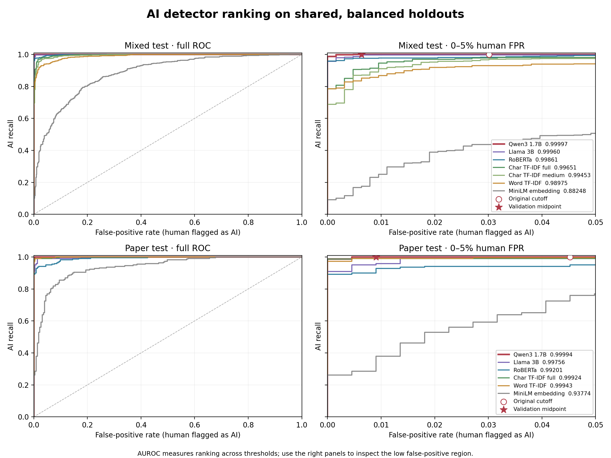

# AUROC and ROC comparison



[Vector ROC PDF](charts/roc_curves.pdf) · [All baseline AUROCs](charts/auroc_overview.pdf) · [Overview PNG](charts/auroc_overview.png) · [Recomputed curve values](auroc_scores.json)

AUROC summarizes how well a score ranks AI above human text **across all possible thresholds**. Moving the decision threshold changes the operating point on a ROC curve; it does not change AUROC or model weights. The right-hand panels zoom into 0–5% human false-positive rate. The open circles mark the original Qwen threshold and the stars mark the validation midpoint proposed in the [threshold report](threshold-tradeoff.md).

| Shared holdout | Qwen3 1.7B | Strongest reference | Strongest trained baseline |
| --- | ---: | ---: | ---: |
| Mixed, 631 human + 631 AI | **0.99997** | Llama 3B 0.99960 | Character TF-IDF full 0.99651 |
| Paper abstracts, 221 + 221 | **0.99994** | Llama 3B 0.99756 | Word TF-IDF full 0.99943 |

The Qwen curve stays at or near full AI recall at low human FPR on these holdouts. Raising its threshold from the original cutoff to the validation midpoint moves mixed-test false positives from 19/631 to 4/631 while retaining 631/631 AI detections. On paper abstracts, it moves from 10/221 to 2/221 while retaining 221/221 AI detections. These points were calculated from the cached logit margins, so their AUROC differs slightly from the original probability-based metric where probabilities saturated at 1.

The overview includes every saved baseline tier on the mixed, paper, general EditLens, and PMC-only tests, including the frozen [load-bearing PR vocabulary transfer baseline](load-bearing-transfer.md). That model identifies one GitHub PR-writing cluster and does not transfer as an AI detector here. The ROC curves use matching test examples for each model. The Llama result on general EditLens uses a smaller 500+500 test, so it is marked separately. Qwen is absent from the PMC-only test because that test overlaps its training data; the paper subset of the mixed test is clean and included here.

These are promising pilot results, especially for the low-FPR region, but the paper AI holdout uses only two small, title-prompted local generators. The other 65% of the mixed test comes from EditLens and includes Claude, GPT, and Gemini outputs, but it follows the same benchmark construction and largely the same generator families used in training. We need independently collected papers, harder generators, and edited AI text before relying on these rates in deployment. AUROC on balanced test sets also does not establish a real-world false-positive rate.

Raw baseline scores and input hashes are in `/mnt/f/pangram-at-home/runs/roc_cache_v1`; Qwen scores are in its existing `score_cache_v1`. The reproduced baseline AUROCs match every previously saved scalar result exactly. Regenerate with:

```bash
for dataset in mixed paper; do
  for model in char word embedding roberta llama; do
    python scripts/cache_baseline_roc_scores.py --dataset "$dataset" --model "$model"
  done
done
python scripts/cache_baseline_roc_scores.py --dataset mixed --model char_full
python scripts/chart_auroc.py
```
