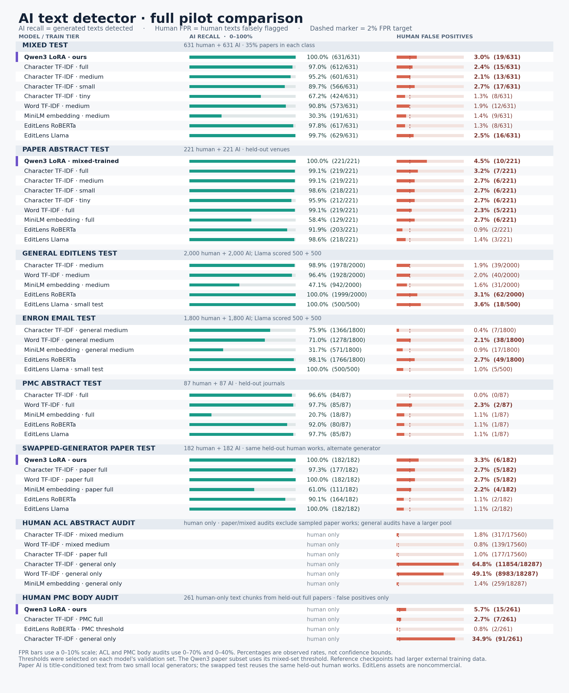

# Full pilot results comparison

[Download the vector PDF](charts/full_results.pdf) · [Download the plotted values as CSV](charts/full_results.csv)

The mixed test shows the main tradeoff: the Qwen3 LoRA model detects 631/631 AI texts but flags 19/631 human texts (3.0%), exceeding the <2% false-positive target. Its paper subset flags 10/221 humans (4.5%); the PMC full-body audit flags 15/261 human chunks (5.7%). The EditLens RoBERTa reference flags 8/631 humans (1.3%) on the mixed test, while detecting 617/631 AI texts (97.8%).

Each row uses its saved validation-selected threshold. The Qwen3 paper row is the paper subset of the mixed test at its **mixed** validation threshold. Paper-only baselines used paper validation; the PMC-only and EditLens-only sections likewise use their respective validation sets. The published reference checkpoints had substantially more external training data than the local baselines. In the general EditLens and Enron sections, the Llama reference was run on smaller 500-human/500-AI test tiers. The paper AI samples were generated from titles by two small local models; these results do not measure detection of frontier generators or edited writing.

The ACL audits use different human pools: paper and mixed model audits exclude every sampled paper work (17,560 abstracts), whereas the general EditLens model audits used 18,287 abstracts. The swapped-generator test reuses the same held-out human works, so its human false-positive result is correlated with the paper test. The source metrics are in [`metrics/`](metrics), and [`scripts/chart_full_results.py`](../scripts/chart_full_results.py) regenerates the chart and CSV.
