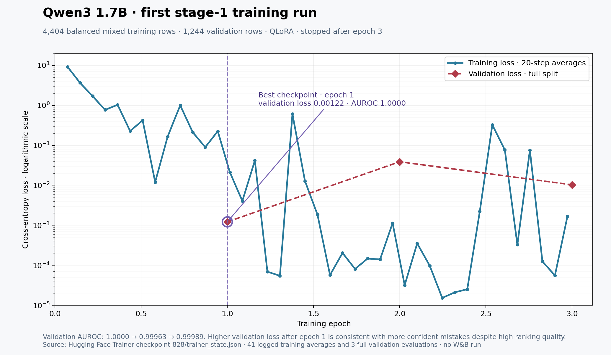

# First Qwen3 stage-1 run: training and validation loss

[Vector PDF](charts/qwen3_stage1_loss.pdf) · [Source summary](qwen3-stage1-loss.json)

This run did **not** report to Weights & Biases. [`scripts/train_segment_lora.py`](../scripts/train_segment_lora.py) configured Hugging Face Trainer with `report_to="none"`. The final `checkpoint-828/trainer_state.json` on the external drive contains 41 training-loss entries, logged every 20 optimizer steps, and three full validation evaluations. The chart is reconstructed directly from that file, whose SHA-256 is recorded in the source summary.

| Epoch | Step | Validation loss | Reported validation AUROC |
| ---: | ---: | ---: | ---: |
| **1** | **276** | **0.00122** | **1.00000** |
| 2 | 552 | 0.03874 | 0.99963 |
| 3 | 828 | 0.01028 | 0.99989 |

Training loss falls sharply and is mostly very low after epoch 1, with occasional spikes. Validation loss is lowest at epoch 1 and rises afterward, consistent with greater confidence on the remaining mistakes or a small amount of overfitting. Validation AUROC remains near 1 because ranking and cross-entropy measure different things. The selected adapter is the **epoch-1 checkpoint**, and early stopping ended the run after epoch 3. The logarithmic loss axis makes late training values visible; the dashed validation line joins only three measured points.

Training loss is a 20-step average on the training stream, whereas validation loss covers the whole validation split. This plot describes optimization on the existing pilot data; it does not resolve the dataset-transfer limitations described in the [AUROC report](auroc-comparison.md).

Regenerate with `python scripts/chart_training_loss.py` while `/mnt/f/pangram-at-home/runs/qwen3_17b_mixed_stage1_v1/checkpoint-828/trainer_state.json` is available.
