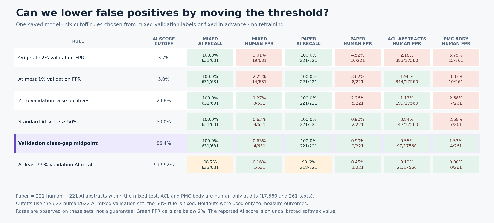

# Qwen3 threshold sweep



[Vector PDF](charts/threshold_tradeoff.pdf) · [All counts and rates](threshold-tradeoff.csv) · [Frozen operating-point configuration](../configs/qwen3_stage1_operating_point.json)

The first Qwen3 run used an AI-score cutoff of **3.74%**. Its calibration rule spent nearly the full 2% validation false-positive allowance even though all validation AI examples scored well above every validation human example. The highest human logit margin was −1.1641; the lowest AI margin was 4.8594. Their midpoint is 1.8477, equivalent to an **86.39% uncalibrated AI score**. This numerical cutoff is determined entirely from the frozen mixed validation split; holdout labels were used to compare the candidate rules. The model weights have not changed.

| Holdout | Original AI detected | Midpoint AI detected | Original human FP | Midpoint human FP |
| --- | ---: | ---: | ---: | ---: |
| Mixed test | 631/631 | 631/631 | 19/631 (3.01%) | **4/631 (0.63%)** |
| Paper abstracts within mixed test | 221/221 | 221/221 | 10/221 (4.52%) | **2/221 (0.90%)** |
| General EditLens | 2,000/2,000 | 1,999/2,000 | 41/2,000 (2.05%) | **7/2,000 (0.35%)** |
| Enron email | 1,800/1,800 | 1,799/1,800 | 38/1,800 (2.11%) | **2/1,800 (0.11%)** |
| Swapped-generator papers | 182/182 | 182/182 | 6/182 (3.30%) | **0/182 (0%)** |
| ACL human abstract audit | — | — | 383/17,560 (2.18%) | **97/17,560 (0.55%)** |
| PMC human body audit | — | — | 15/261 (5.75%) | **4/261 (1.53%)** |

This midpoint is a useful **candidate research operating point**: every measured human false-positive rate is below 2%, while recall falls by only two AI texts across the general EditLens and Enron tests. Its numerical cutoff came solely from validation data. We selected it for further consideration after reviewing these holdout outcomes, so a fresh independent evaluation is needed before treating its rates as final. The [full baseline comparison](charts/full_results.pdf) now shows both Qwen3 cutoffs, preserving the original result.

A stricter, also validation-selected alternative targets at least 99% AI recall on validation. Its score cutoff is 99.992%. On the mixed test it detects 623/631 AI texts (98.7%) and falsely flags 1/631 humans (0.16%); on paper abstracts it detects 218/221 AI texts (98.6%) and flags 1/221 humans (0.45%). It flags 21/17,560 ACL abstracts (0.12%) and 0/261 PMC body chunks. This may suit a later application that places especially high cost on false accusations, but the present AI test is dominated by small, title-conditioned local generators, so its recall on frontier or edited AI writing remains unknown.

The audit sizes matter: 2/221 paper false positives and 4/261 paper-body false positives do **not** establish a population false-positive rate below 2%. The ACL abstract audit is much larger, but covers one scholarly domain. The softmax score is not calibrated as a true probability. Cached batch-8 inference reproduced the original mixed-test, swapped-generator, and PMC-body counts at the original cutoff; it flagged 11 rather than the original 12 validation humans due to small batch-dependent numerical changes. The threshold sweep used the same cached inference settings for every operating point.

The score arrays, input hashes, and adapter hash are stored outside Git at `/mnt/f/pangram-at-home/runs/qwen3_17b_mixed_stage1_v1/score_cache_v1`; [`scripts/cache_segment_scores.py`](../scripts/cache_segment_scores.py) and [`scripts/analyze_threshold_tradeoff.py`](../scripts/analyze_threshold_tradeoff.py) reproduce this analysis.

```bash
python scripts/cache_segment_scores.py
python scripts/analyze_threshold_tradeoff.py
python scripts/chart_threshold_tradeoff.py
python scripts/chart_full_results.py
```
